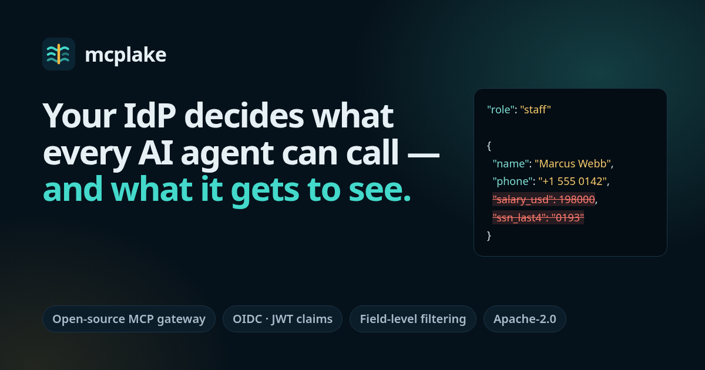
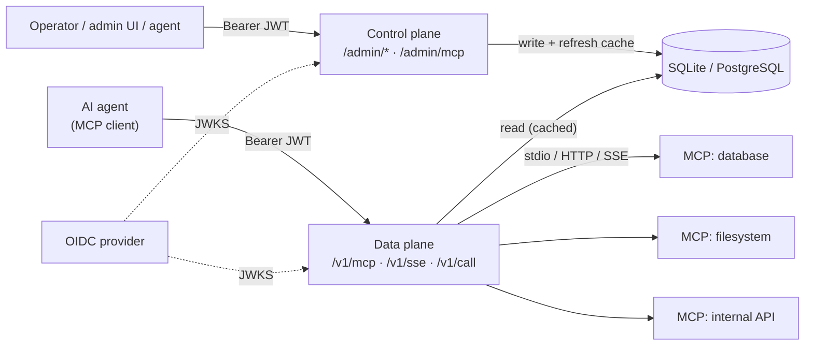
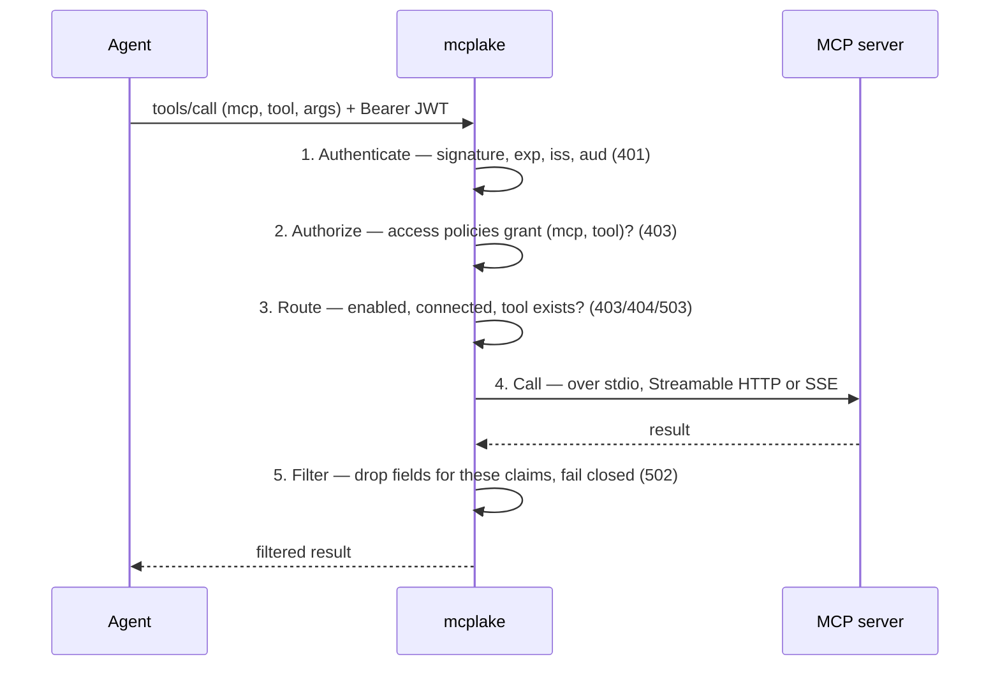
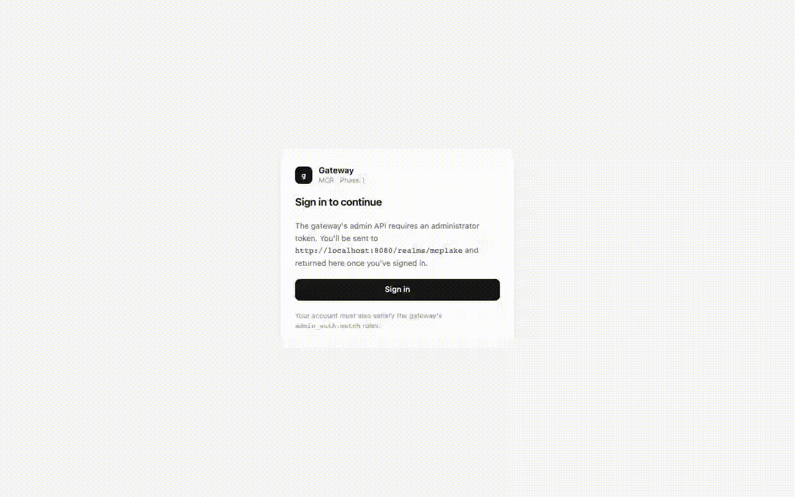

<div align="center">


# mcplake

### The identity-aware MCP gateway

**Your identity provider decides what every AI agent can call — and what it gets to see.**

[](LICENSE)
[](go.work)
[](https://modelcontextprotocol.io)
[](https://atsokha.github.io/mcplake/latest/)
[](CONTRIBUTING.md)

[Website](https://atsokha.github.io/mcplake/) ·
[Quickstart](#-quickstart-5-minutes) ·
[Documentation](https://atsokha.github.io/mcplake/latest/) ·
[Why mcplake](#-why-mcplake) ·
[Comparison](#-how-it-compares) ·
[Contributing](#-contributing)

</div>

---

**mcplake** is a free, open-source gateway for the [Model Context Protocol](https://modelcontextprotocol.io). It sits between AI agents and the MCP servers they use, and for every call it:

1. **authenticates** the caller with a JWT from your OIDC provider (Keycloak, Okta, Entra ID, Auth0, …),
2. **authorizes** the exact MCP server and tool from the token's claims,
3. **shows** each agent only the tools it is allowed to use, and
4. **removes the response fields** the caller isn't allowed to see — *before* they reach the model's context window.

One Go binary. Embedded SQLite. No telemetry. No paid tier. Ever.

<div align="center">

</div>

## Table of contents

- [Why mcplake](#-why-mcplake)
- [What makes it different](#-what-makes-it-different)
- [Quickstart (5 minutes)](#-quickstart-5-minutes)
- [How it works](#-how-it-works)
- [Features](#-features)
- [Configuration at a glance](#-configuration-at-a-glance)
- [Connect your MCP client](#-connect-your-mcp-client)
- [Use cases](#-use-cases)
- [How it compares](#-how-it-compares)
- [Install and build](#-install-and-build)
- [Project layout](#-project-layout)
- [Roadmap and known limitations](#-roadmap-and-known-limitations)
- [FAQ](#-faq)
- [Contributing](#-contributing)
- [License](#-license)

## 💡 Why mcplake

MCP servers were built for one user on one laptop. An MCP server typically runs with a single set of credentials and hands **every tool and every field** to whoever connects. That breaks down the moment agents act on behalf of many people:

| Problem | What happens without a gateway | What mcplake does |
|---|---|---|
| **Over-privileged agents** | A support bot that only needs lookups can also call `drop_table`. Prompt injection turns that into an incident. | Grants individual `(mcp, tool)` pairs from token claims. Everything else is `403` — and never even listed. |
| **Data leakage into the model** | Salaries, SSNs, API keys and addresses land in the context window, the logs and the model provider — entitled or not. | Drops the fields a caller may not see from every copy of the payload, and fails closed if it can't. |
| **Yet another identity system** | Gateways want their own users, API keys or "virtual keys", and put SSO behind an enterprise licence. | Uses the IdP you already have. Move a user between groups there; their tools and fields change on the next call. |

## ✨ What makes it different

Plenty of gateways decide **which tools** an agent may call. mcplake also decides **what an allowed tool's answer contains**, per caller, from the identity you already have.

- **Identity-aware field-level filtering.** Not "detect things that look like PII" — deterministic JSONPath removal of exactly the fields *this caller* may not see. One `get_employee` tool serves HR (with salaries) and everyone else (without). No duplicate servers, no trusting the agent to ignore data.
- **One rule engine, applied twice.** The same JSONPath + regex claim rules that grant a tool decide what's filtered out of its result. One mental model, one place to audit.
- **No leak through the copy you forgot.** MCP results often carry data twice (`structuredContent` *and* JSON text in `content`). mcplake filters every copy. If a filter applies but the payload can't be parsed, it **refuses** the response instead of passing it through.
- **Your IdP is the single source of truth.** No gateway user database, no keys to rotate, no per-user state. OIDC isn't an enterprise add-on — it's the whole model.
- **Explainable decisions.** The admin UI's *request path* view takes a token's claims and shows, stage by stage, which policy granted or denied a call and which fields each filter removes.
- **A gateway agents can operate.** Every admin operation is available as REST, in the web UI, *and* as MCP tools on an optional control server — gated by the same claim rules.
- **Built for networks with no way out.** One binary, embedded SQLite, no phone-home. The only outbound traffic is to your IdP's JWKS endpoint and the MCP servers you register.
- **Fully open source.** Apache-2.0, no enterprise edition, no feature gating.

## 🚀 Quickstart (5 minutes)

The demo stack starts **Keycloak**, **PostgreSQL**, the **gateway**, the **admin UI**, **MCP Inspector** and several **MCP servers** (one as a stdio subprocess, others over the network), with users whose tokens get different tools and different fields.

**Prerequisites:** Docker with Compose (or Podman), `curl`, `jq`, and free ports `8080`, `8082`, `9090`, `9091`.

```bash
git clone https://github.com/atsokha/mcplake.git
cd mcplake
docker compose up -d --build        # or: podman compose up -d --build

curl -s http://localhost:9090/healthz   # → ok
```

**Call a tool as `alice`** (role `db-reader`) — the record comes back *without* `salary_usd` and `ssn_last4`:

```bash
ALICE=$(curl -s -X POST http://localhost:8080/realms/mcplake/protocol/openid-connect/token \
  -d grant_type=password -d client_id=mcplake-demo \
  -d username=alice -d password=alice -d scope=openid | jq -r .access_token)

curl -s -X POST http://localhost:9090/v1/call \
  -H "Authorization: Bearer $ALICE" -H "Content-Type: application/json" \
  -d '{"mcp":"employee-directory","tool":"get_employee","arguments":{"employee_id":2}}' \
  | jq .structuredContent
```

**Try the same as `bob`** (role `guest`) and you get `403 forbidden`. Then open **http://localhost:8082/** and sign in as `mcplake-admin` / `mcplake-admin` to see and change the policies you just exercised — changes apply on the next call, no restart.

| User / password | `role` claim | What they get |
|---|---|---|
| `alice` / `alice` | `db-reader` | `employee-directory`, with salary and SSN removed |
| `bob` / `bob` | `guest` | Nothing |
| `mcplake-admin` / `mcplake-admin` | `admin` | Every MCP, unfiltered, plus the admin API and UI |

Full walkthrough: [Quickstart](docs/getting-started/quickstart.rst) · [Demo tour](docs/getting-started/demo.rst) · [Your first gateway](docs/getting-started/first-gateway.rst)

## 🔍 How it works

mcplake runs two independent listeners that share only the store underneath:



Every tool call — MCP `tools/call` or REST `POST /v1/call` — runs the same pipeline:



Authorization happens **before** existence checks: a caller without a grant gets `403` whether or not the MCP or tool exists, so a refusal reveals nothing. Agents connected over MCP see one catalogue with every tool named `<mcp>__<tool>`, filtered to exactly what their token grants.

Deep dive: [How it works](docs/concepts/how-it-works.rst) · [Architecture overview](docs/architecture/overview.rst) · [Security model](docs/architecture/security.rst)

### See it live

Recorded against the real [compose demo](docs/getting-started/demo.rst) — same two MCPs, same three users (`alice`/`bob`/`mcplake-admin`), same policies, not staged for the screenshot.

<table>
<tr>
<td width="50%">

**Steps 2 + 5 — authorize, then filter**<br>
Same tool, same employee, called as alice (`role=db-reader`) then mcplake-admin (`role=admin`). One response has `salary_usd`/`ssn_last4` stripped; the other doesn't — same code path, decided entirely by claims.


</td>
<td width="50%">

**The whole pipeline, visualized**<br>
The admin UI's own request-path simulator walks a call through Auth Validator → Access Check → Response Filter and shows each stage's real verdict — not a diagram, the actual decision.


</td>
</tr>
<tr>
<td width="50%">

**Step 1 — authenticate**<br>
Three users, one Keycloak realm, one claim (`role`) that everything downstream — routing, filtering, the admin UI's own gate — acts on.


</td>
<td width="50%">

**Step 2 — the deny path**<br>
bob authenticates fine — Keycloak hands him a perfectly valid token — but no `access_policy` grants `role=guest` anything, so the call never reaches the MCP.


</td>
</tr>
<tr>
<td width="50%">

**The enabled gate, live**<br>
An operator disables `employee-directory` via `PATCH /admin/mcps/:name` — a live `200` becomes `403 mcp_disabled` for every caller, reversibly, with no reconnect needed to turn it back on.


</td>
<td width="50%">

**Signing in to the admin UI**<br>
A real Authorization Code + PKCE round trip through Keycloak, not a token pasted by hand — the same flow an operator goes through in a browser.



</td>
</tr>
<tr>
<td width="50%">

**Per-MCP grants, across transports**<br>
alice's grant names `employee-directory` (stdio) and nothing else; mcplake-admin's wildcard reaches `inventory` too — a second MCP, its own container, over `sse` — same router, same code path, different transport.


</td>
<td width="50%">

**The control plane, as an MCP server**<br>
MCP Inspector driving `/admin/mcp` itself (ADR-0011) — `list_mcps` called over real MCP, through the same bearer-token gate as the REST API, not a REST shortcut.


</td>
</tr>
</table>

More scenarios and the scripts that produced these in [`docs/media/pipeline/`](docs/media/pipeline/).

## 🧩 Features

**Security & policy**
- OIDC / JWT authentication — signature, expiry, issuer and audience on every call; JWKS cached
- Claims-based access policies — [JSONPath](https://www.rfc-editor.org/rfc/rfc9535) + RE2 rules on any claim (roles, groups, tenant, region, nested claims like `realm_access.roles`)
- Grants per MCP server or per individual tool, with `*` wildcards
- Field-level response filtering per caller, across every payload copy, fail-closed; dead paths logged as warnings
- Per-caller `tools/list` — agents are never offered a tool they would only get `403` from
- Reversible kill switches: disable any MCP server, access policy or filter policy without deleting it

**MCP connectivity**
- Serves MCP over **Streamable HTTP** (`/v1/mcp`) and **SSE** (`/v1/sse`), plus plain REST (`POST /v1/call`)
- Reaches downstream servers over **stdio** (supervised subprocess with a minimal environment), **Streamable HTTP** or **SSE**
- Health-check loop that reconnects servers that restart or start late
- Periodic schema refresh to pick up new or changed tools

**Operations**
- Control-plane REST API with OpenAPI/Swagger, protected by JWT + claim rules
- Admin web UI (React, OIDC PKCE login): servers, tools, status, policies, users, and the request-path explainer
- Optional **MCP control server** — admin operations as MCP tools
- Live changes: every update is effective on the next call
- Single TOML config file, seeded into SQLite (default) or PostgreSQL
- No telemetry; runs fully offline

## ⚙️ Configuration at a glance

```toml
[server]
data_plane_addr    = ":8080"
control_plane_addr = "127.0.0.1:8081"

[oidc]
jwks_url = "https://auth.example.com/.well-known/jwks.json"
issuer   = "https://auth.example.com"
audience = "mcp-gateway"

[[mcps]]
name    = "employee-directory"
type    = "stdio"                  # or "http" / "sse" with url = "https://…"
command = "employee-directory-mcp"

# Staff and HR may use the directory…
[[access_policies]]
name = "staff"
[[access_policies.match]]
path    = "$.role"
pattern = "^(staff|hr)$"
[[access_policies.grants]]
mcp   = "employee-directory"
tools = ["*"]

# …but staff never see pay or SSNs.
[[filter_policies]]
name        = "staff-hide-pay"
mcp         = "employee-directory"
tool        = "get_employee"
drop_fields = ["$.salary_usd", "$.ssn_last4"]
[[filter_policies.match]]
path    = "$.role"
pattern = "^staff$"
```

| Caller's token | `tools/list` | `get_employee` returns |
|---|---|---|
| `role = "hr"` | directory tools | the full record |
| `role = "staff"` | directory tools | the record **without** `salary_usd`, `ssn_last4` |
| `role = "guest"` | *(empty)* | `403 forbidden` |

All options: [`config.example.toml`](config.example.toml) · [Configuration reference](docs/reference/configuration.rst) · [Claim rules](docs/concepts/claim-rules.rst) · [Access policies](docs/concepts/access-policies.rst) · [Response filtering](docs/concepts/response-filtering.rst)

## 🔌 Connect your MCP client

mcplake is itself an MCP server. Any client that can send an `Authorization` header works.

**Claude Code**

```bash
claude mcp add --transport http mcplake http://localhost:9090/v1/mcp \
  --header "Authorization: Bearer $TOKEN"
```

**Cursor, VS Code and other JSON-configured clients**

```json
{
  "mcpServers": {
    "mcplake": {
      "url": "http://localhost:9090/v1/mcp",
      "headers": { "Authorization": "Bearer <your token>" }
    }
  }
}
```

**MCP Inspector** is included in the demo stack. See [Connect MCP clients](docs/use-cases/connect-mcp-clients.rst) and the [Data-plane API](docs/reference/data-plane-api.rst).

## 🎯 Use cases

| You want to… | Guide |
|---|---|
| Serve HR and everyone else from one tool, with salaries hidden for most | [Redact sensitive fields](docs/use-cases/redact-sensitive-fields.rst) |
| Give analysts the read replica and on-call engineers write access | [Read-only and read-write](docs/use-cases/read-only-and-read-write.rst) |
| Grant one team one server, another team another, a bot a single tool | [Per-user and per-server access](docs/use-cases/per-user-and-per-server-access.rst) |
| Turn a local stdio MCP server into a shared, SSO-protected service | [stdio server behind SSO](docs/use-cases/stdio-server-behind-sso.rst) |
| Run AI tooling in a regulated or offline network | [Air-gapped deployment](docs/use-cases/air-gapped-deployment.rst) |
| Let an authorized agent register servers and manage policies | [Agent-operated gateway](docs/use-cases/agent-operated-gateway.rst) |
| Connect Claude Code, Cursor or MCP Inspector | [Connect MCP clients](docs/use-cases/connect-mcp-clients.rst) |

## ⚖️ How it compares

Bifrost, MCPX, agentgateway, ContextForge and Docker's MCP Gateway are good projects with different goals — LLM routing, governance platforms, Kubernetes-native traffic, API federation, container isolation. mcplake focuses on one thing: **identity-driven governance of MCP, down to the field.**

| Capability | **mcplake** | Bifrost | MCPX (Lunar) | agentgateway | IBM ContextForge | Docker MCP Gateway |
|---|---|---|---|---|---|---|
| Tool access decided by your OIDC IdP's JWT claims | ✅ | 💰 Enterprise (IdP sync, access profiles) | 💰 Enterprise (IdP / SSO) | ✅ CEL rules | ◐ own users, teams & RBAC | — |
| Per-caller filtered `tools/list` | ✅ | ✅ per virtual key | ✅ per profile | ✅ | ✅ virtual servers | — |
| Response fields removed per caller identity | ✅ JSONPath, fail-closed | 💰 guardrails, content-based | — | — | ◐ PII plugin, pattern-based | — |
| Everything open source, no paid tier | ✅ Apache-2.0 | open core | open core | ✅ | ✅ | ✅ |
| Primary focus | MCP identity & data governance | LLM + MCP gateway | MCP governance platform | Agent / MCP / A2A proxy | MCP, A2A & REST federation | Containerised MCP servers |
| Footprint | One Go binary + SQLite | Go binary | Container | Rust binary | Python service | Docker CLI plugin |

<sub>✅ included · ◐ partial · 💰 / open core = requires a paid tier · — not found in public docs. Based on each project's public documentation as of September 2026. Something wrong or out of date? [Open an issue](https://github.com/atsokha/mcplake/issues) and we'll fix it.</sub>

**When to pick something else:** if you need LLM routing, caching and failover, use an LLM gateway (it can sit alongside mcplake). If you need Kubernetes-native traffic management across agents, A2A and MCP, look at agentgateway. If you mainly want to sandbox MCP servers in containers, use Docker's MCP Gateway.

## 📦 Install and build

**Prerequisites:** Go 1.27.1+, [Bun](https://bun.sh) (builds the admin UI embedded in the binary), an OIDC provider, and your MCP servers.

```bash
make build                                    # builds the admin UI, then the gateway
./cmd/gateway/mcp-gateway --config config.toml
```

The binary is written to `cmd/gateway/mcp-gateway`. A bare `go build ./cmd/gateway` on a fresh clone fails until the UI has been built — see [Installation](docs/getting-started/installation.rst).

Useful targets:

| Command | What it does |
|---|---|
| `make build` | Build the admin UI and the gateway binary |
| `make check` | fmt, vet, tests and build — run before every PR |
| `make test` / `make test-race` | Run all Go module tests (with the race detector) |
| `make ui-dev` / `make ui-test` | Admin UI dev server / tests |
| `make docs` / `make docs-serve` | Build / serve the documentation site |
| `make swagger` | Regenerate the OpenAPI spec |

Going to production? Read [Deploy in production](docs/how-to/deploy-in-production.rst), [Secure the control plane](docs/how-to/secure-the-control-plane.rst), [Configure Keycloak](docs/how-to/configure-keycloak.rst) and [Use PostgreSQL](docs/how-to/use-postgresql.rst).

## 🗂 Project layout

mcplake is a Go multi-module workspace ([`go.work`](go.work)); each library is an independent module you can test on its own.

| Path | Purpose |
|---|---|
| [`cmd/gateway`](cmd/gateway) | The gateway binary |
| [`cmd/webui`](cmd/webui) | Standalone server for the admin UI container |
| [`gateway`](gateway) | Core orchestration: data plane (fasthttp), control plane (Gin), admin web UI (React + TypeScript) |
| [`auth`](auth) | JWT validation and OIDC / JWKS |
| [`router`](router) | Claim-rule engine, access and filter policies |
| [`filter`](filter) | Field-level response filtering |
| [`cache`](cache) | MCP registry, tool/schema cache, health checks and schema refresh |
| [`mcp`](mcp) | MCP client: stdio, Streamable HTTP, SSE |
| [`config`](config) | TOML configuration |
| [`persistence`](persistence) | GORM store: SQLite and PostgreSQL |
| [`deploy`](deploy) | Demo stack and container images |
| [`docs`](docs) | Documentation site (Sphinx) and [architecture decision records](docs/architecture/decisions/) |
| [`site`](site) | Project landing page |

Every significant design choice is recorded as an ADR in [`docs/architecture/decisions`](docs/architecture/decisions/) — a good place to start if you want to understand *why* things are the way they are.

## 🛣 Roadmap and known limitations

**Shipped**

- [x] Data plane: OIDC/JWT authentication, claims-based authorization, tool-call proxy
- [x] MCP endpoints on the data plane (Streamable HTTP and SSE) with per-caller `tools/list`
- [x] Unified JSONPath + regex claim-rule engine for access and filtering
- [x] Field-level response filtering across every payload copy, fail-closed
- [x] Downstream stdio, Streamable HTTP and SSE, with health-check reconnection and schema refresh
- [x] Control plane: REST + OpenAPI, admin web UI with OIDC PKCE, MCP control server
- [x] SQLite / PostgreSQL persistence, TOML config seeding
- [x] Documentation site

**Next — help wanted**

- [ ] Audit trail and OpenTelemetry tracing of every decision
- [ ] Argument-level validation and policies on tool inputs
- [ ] Outbound credentials for downstream MCP servers
- [ ] MCP OAuth protected-resource metadata, so clients can discover how to get a token
- [ ] Live pipeline visualization of real traffic
- [ ] Release binaries and published container images

**Known limitations today**

- An MCP server that requires credentials can't be registered yet (no outbound auth).
- Filtering removes fields, not records — to hide whole rows, grant a different tool or server.
- Clients must be given a bearer token; automatic OAuth discovery isn't implemented yet.

## ❓ FAQ

<details>
<summary><b>What is an MCP gateway?</b></summary>

A reverse proxy between AI agents (MCP clients) and MCP servers. Instead of every agent connecting to every server, agents connect to the gateway, which authenticates them, decides what they may use, forwards the call and returns the result. mcplake is an MCP gateway focused on identity: your OIDC provider's token claims decide both access and what data comes back.
</details>

<details>
<summary><b>How is mcplake different from Bifrost?</b></summary>

Bifrost is primarily an LLM gateway that also aggregates MCP tools, with tool access tied to virtual keys and IdP-based access, RBAC and guardrails in its Enterprise edition. mcplake is MCP-only, decides access directly from your IdP's claims in the free open-source core, and removes response fields per caller identity. If you need both, run them side by side.
</details>

<details>
<summary><b>Is field-level filtering the same as PII detection?</b></summary>

No, deliberately. Detection guesses what looks sensitive; mcplake removes exactly the fields you name, for exactly the callers you name. It's deterministic, testable and explainable — and you can still run a detector behind it.
</details>

<details>
<summary><b>Which identity providers work?</b></summary>

Any OIDC provider that publishes a JWKS endpoint: Keycloak, Okta, Microsoft Entra ID, Auth0, Google, Dex, Authentik and others. Rules can match any claim, including nested and list-valued ones.
</details>

<details>
<summary><b>Can it run air-gapped?</b></summary>

Yes. One binary, embedded SQLite by default, no telemetry, and no outbound calls except to your IdP's JWKS endpoint and the MCP servers you register. See [Air-gapped deployment](docs/use-cases/air-gapped-deployment.rst).
</details>

<details>
<summary><b>Is it really free?</b></summary>

Yes. Apache-2.0, no paid tier, no enterprise edition, no feature gating, no telemetry.
</details>

## 🤝 Contributing

mcplake is built in the open and contributions of every size are welcome — bug reports, docs fixes, new use-case guides, and features from the roadmap.

**Ways to help right now**

- ⭐ **Star the repo** — it's the simplest way to help others find it.
- 🧪 **Run the demo** and [open an issue](https://github.com/atsokha/mcplake/issues) for anything that confused you or broke.
- 🔌 **Try it with your IdP and MCP servers** and share what worked (or didn't) — new how-to guides are very welcome.
- 🛠 **Pick a roadmap item** — audit trail, argument-level policies and outbound credentials are great places to start.

**Workflow in short**

1. Start from a GitHub issue.
2. Branch from `develop` as `feature/<issue-number>_<short_title>`.
3. Include tests and documentation with the change.
4. Run `make check` (plus `make ui-test` / `make docs-check` if you touched the UI or docs).
5. Open a pull request into `develop` referencing the issue.

The dev container in [`.devcontainer/`](.devcontainer/) has Go, Bun and uv preinstalled. See [CONTRIBUTING.md](CONTRIBUTING.md) and the [development guide](docs/development/index.rst) for details.

## 📄 License

Licensed under the [Apache License, Version 2.0](LICENSE). By contributing, you agree that your contributions are licensed under the same terms.

---

<div align="center">
<sub>If mcplake is useful to you, a ⭐ helps other people find it.</sub>
<br>
<sub><b>Keywords:</b> MCP gateway · Model Context Protocol · MCP proxy · MCP access control · MCP authorization · OIDC · JWT · RBAC / ABAC for AI agents · PII redaction · field-level filtering · AI agent security · air-gapped AI · Go</sub>
</div>
