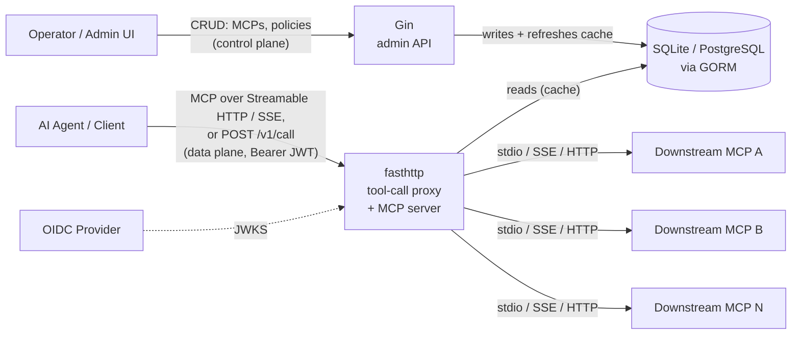
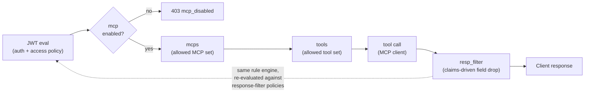

# Architecture Overview

This document describes the current architectural direction for the MCP Gateway,
superseding the high-level sketch in [`/docs/OVERVIEW.md`](../OVERVIEW.md) with the
concrete pipeline being built for Phase 1. Component detail lives in
[`components.md`](components.md); data structures and request/response flow live in
[`data.md`](data.md); trust boundaries and what is authenticated/authorized where
live in [`security.md`](security.md). Individual technology and pattern choices are
recorded as ADRs in [`decisions/`](decisions/).

## System Boundary

The gateway is the single trust boundary between callers and downstream MCP servers.
Callers never talk to an MCP directly. The gateway is the only component that knows
which MCPs exist, what they can do, and what a given caller is allowed to see.

The gateway exposes **two separate HTTP surfaces**, each built on the stack suited to
its workload ([ADR-0001](decisions/0001-use-fasthttp-for-gateway-server.md),
[ADR-0005](decisions/0005-use-gin-for-control-plane-api.md)):

- **Data plane** (`fasthttp`) — the performance-critical tool-call proxy, read-only
  against the policy/registration store via an in-memory cache. It speaks MCP
  itself, at `/v1/mcp` (Streamable HTTP) and `/v1/sse`, so an off-the-shelf MCP
  client can connect to the gateway directly; `POST /v1/call` remains for callers
  that prefer plain REST. Both run the same pipeline
  ([ADR-0020](decisions/0020-serve-mcp-on-the-data-plane.md)).
- **Control plane** (`Gin`) — low-volume CRUD for MCP registrations and access/filter
  policies, backed by SQLite by default and PostgreSQL for distributed deployments
  ([ADR-0006](decisions/0006-gorm-sqlite-postgres-persistence.md)).

The two surfaces never share a request path; they only share the persistence layer
underneath them.

## Goal for This Milestone

1. A data-plane HTTP gateway (built on `fasthttp` — see [ADR-0001](decisions/0001-use-fasthttp-for-gateway-server.md))
   that terminates tool-call requests, evaluates the caller's JWT, and routes to the
   correct downstream MCP.
2. A control-plane admin API (built on `Gin` — see [ADR-0005](decisions/0005-use-gin-for-control-plane-api.md))
   so downstream MCPs and access/filter policies can be registered and managed at
   runtime, backed by persistent storage (SQLite by default, PostgreSQL for
   distributed deployments — see [ADR-0006](decisions/0006-gorm-sqlite-postgres-persistence.md)).
   On registration, an MCP's tools and I/O schemas are fetched and cached
   (see [ADR-0003](decisions/0003-dynamic-mcp-registration-and-schema-discovery.md)).
   The admin API is JWT-authenticated and claim-gated when `admin_auth` is
   configured (see [ADR-0010](decisions/0010-control-plane-admin-authentication.md)),
   and can additionally be exposed as MCP tools for MCP-speaking operators
   (see [ADR-0011](decisions/0011-mcp-control-server.md)).
3. An MCP-protocol data-plane surface, so the gateway is reachable by any MCP client
   and its `tools/list` is filtered per caller to exactly the tools that caller's
   access policy grants (see [ADR-0020](decisions/0020-serve-mcp-on-the-data-plane.md)).
4. A single policy pipeline that runs the same JWT-claim rule evaluation twice per
   request — once to authorize which MCPs/tools a caller may invoke, and once to decide
   which response fields must be dropped before the result reaches the caller
   (see [ADR-0002](decisions/0002-jsonpath-regexp-claim-rule-engine.md) and
   [ADR-0004](decisions/0004-unified-policy-engine-for-access-and-filtering.md)).

## Pipeline (per request)

Read as: a JWT is evaluated once to authorize a `(mcp, tool)` pair; the call executes;
the response is passed back through the same claim-rule engine — this time matched
against filter policies instead of access policies — before it leaves the gateway. Full
sequence and payload shapes are in [`data.md`](data.md#request-lifecycle).

Each of MCP registrations, access policies, and filter policies carries an operator
`Enabled` flag (default true). Disabling one is a reversible kill switch, not a delete:
a disabled MCP rejects every call with `403 mcp_disabled` while staying connected; a
disabled access policy grants nothing (so the pipeline never starts); a disabled filter
policy strips nothing (so the response is returned unfiltered). See
[ADR-0009](decisions/0009-operator-enable-disable-flag.md),
[`data.md`](data.md#enabledisable-gates), and [`CONFIG.md`](../CONFIG.md).

## Non-Goals for This Milestone

- Argument-level request validation against input schemas (Phase 2).
- Pluggable/scripted transforms beyond field-drop filtering (Phase 2).
- Audit trail persistence and distributed tracing (Phase 3).
- Multi-gateway federation.

These remain listed in [`/docs/OVERVIEW.md`](../OVERVIEW.md#future-considerations) and
are unchanged by this milestone.
